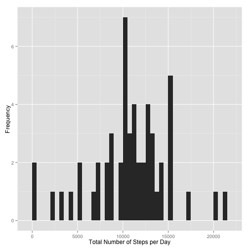
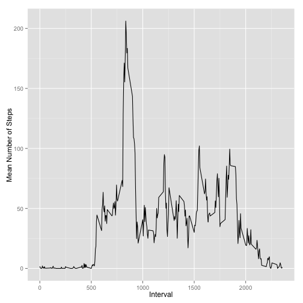
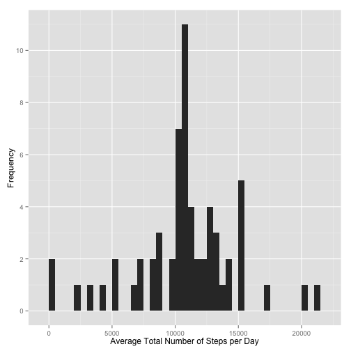
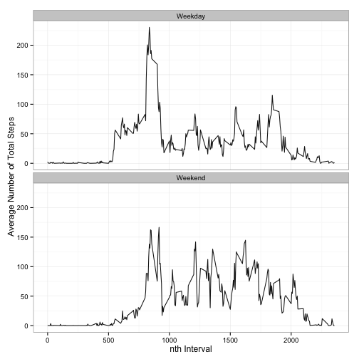

This assignment requires us to generate a single **R markdown** document generated using the [knitr][1] package, which is "designed to be a transparent engine for dynamic report generation with R." The final document output is an **HTML** file. This code was written in [R Studio][2].

[1]: http://yihui.name/knitr/ "knitr"
[2]: http://www.rstudio.com/ "R Studio"


## Setting Default Global Options
For this document, four default global chunk options are set: `echo = TRUE`, `results = 'hold'`, 
`message = FALSE`, and `warning = FALSE`. These are implemented in the **R** code chunk below.

```r
library(knitr)
opts_chunk$set(echo = TRUE, results = 'hold', message = FALSE, warning = FALSE)
```

##Data Analysis
Here, we work with the [Activity monitoring data][3] provided in the course.

[3]: https://d396qusza40orc.cloudfront.net/repdata%2Fdata%2Factivity.zip "Activity monitoring data" 

###Reading the Data
In this section, we load and read the raw *Activity Monitoring Data*. The dataset has been downloaded and unzipped and is located in the same location as this **R markdown (.Rmd)** file. Note that for loading the data, the chunk option `cache = TRUE`.


```r
fileName <- "activity.csv"
activity <- read.csv(fileName)
```

Taking a peek at the data set, we have


```r
head(activity)
```

```
##   steps       date interval
## 1    NA 2012-10-01        0
## 2    NA 2012-10-01        5
## 3    NA 2012-10-01       10
## 4    NA 2012-10-01       15
## 5    NA 2012-10-01       20
## 6    NA 2012-10-01       25
```

and its summary.


```r
summary(activity)
```

```
##      steps               date          interval   
##  Min.   :  0.0   2012-10-01:  288   Min.   :   0  
##  1st Qu.:  0.0   2012-10-02:  288   1st Qu.: 589  
##  Median :  0.0   2012-10-03:  288   Median :1178  
##  Mean   : 37.4   2012-10-04:  288   Mean   :1178  
##  3rd Qu.: 12.0   2012-10-05:  288   3rd Qu.:1766  
##  Max.   :806.0   2012-10-06:  288   Max.   :2355  
##  NA's   :2304    (Other)   :15840
```


###Mean total number of steps taken per day

To obtain the mean total number of steps taken per day, we first sum up all the steps per day and store the results in `spd.total`. 


```r
spd.total <- aggregate(steps~date, activity, sum, na.rm=TRUE)
head(spd.total)
```

```
##         date steps
## 1 2012-10-02   126
## 2 2012-10-03 11352
## 3 2012-10-04 12116
## 4 2012-10-05 13294
## 5 2012-10-06 15420
## 6 2012-10-07 11015
```

Note that all `NA` values were removed (`na.rm=TRUE`) in the aggregation. We then take the mean of the steps values in `spd.total`. 


```r
mean.steps.per.day <- mean(spd.total$steps)
median.steps.per.day <- median(spd.total$steps)
```

This gives us the **mean total number of steps taken per day**, which is 10766. The **median** is 10765.

####Histogram

Below, we plot the histogram of the total number of steps per day.


```r
library(ggplot2)
ggplot(data=spd.total, aes(x=steps)) + geom_histogram(binwidth=500) +
    scale_y_continuous(breaks=seq(0,12,2)) +
    labs(x="Total Number of Steps per Day", y ="Frequency")
```

 


###Average Daily Activity Pattern

In this section, we evaluate the average daily activity pattern of the subject by looking at the mean number of steps produced in each of the 5-min interval across the days. To do this, we aggregate the dataset per interval and take the mean of the steps per interval. We then plot the mean values per interval.


```r
steps.per.interval <- aggregate(steps~interval, activity, mean, na.rm=TRUE)
ggplot(steps.per.interval, aes(interval, steps)) + geom_line() +
    labs(x="Interval", y ="Mean Number of Steps") 
```

 

To evaluate the $n$th interval at which a maximum is observed, the following is implemented.


```r
interval.with.max.steps <- steps.per.interval[which.max(steps.per.interval$steps),]$interval
```

The interval with the maximum number of average steps in a day is the **835th** with a mean of 206.1698 steps.

####Imputing missing values

The total number of missing values, `NA`, can be obtained by running the following code chunk


```r
nas <- sum(is.na(activity$steps))
```

This gives a total of 2304 observations in the dataset that have `NA` entries under `steps`.

The idea is to replace the `NA` values with synthetic ones or *estimates*. Since each of the observation indicates a particular interval *i*, we shall replace the `NA` values with the expected number of steps for *i*. 

Below, we create a copy of the original `activity` data frame and call it `activity2`. In this new data frame, we impute the mean values to the `NA` entries under `steps`.


```r
new <- function(x, y){
    new.steps <- x$steps
    all.nas <- which(is.na(new.steps))
    for (a in all.nas){
        intrvl <- x[a,]$interval
        avg.step <- y[y$interval==intrvl,]$steps  
        new.steps[a] <- avg.step
    }
    new.steps
}

new.steps <- new(activity, steps.per.interval)
activity2 <- data.frame(steps = new.steps, date=activity$date, interval=activity$interval)
```

The data frame `activity2` looks:


```r
head(activity2)
```

```
##     steps       date interval
## 1 1.71698 2012-10-01        0
## 2 0.33962 2012-10-01        5
## 3 0.13208 2012-10-01       10
## 4 0.15094 2012-10-01       15
## 5 0.07547 2012-10-01       20
## 6 2.09434 2012-10-01       25
```

Notice the difference with `activity`.


```r
head(activity)
```

```
##   steps       date interval
## 1    NA 2012-10-01        0
## 2    NA 2012-10-01        5
## 3    NA 2012-10-01       10
## 4    NA 2012-10-01       15
## 5    NA 2012-10-01       20
## 6    NA 2012-10-01       25
```

Now, we examine closer `activity2` and compare it with `activity`. First, we take a look at the histogram of the total number of steps per day in `activity2` as we did for the dataset in `activity` above.


```r
spd.total2 <- aggregate(steps~date, activity2, sum, na.rm=TRUE)
mean.steps.per.day2 <- mean(spd.total2$steps)
median.steps.per.day2 <- median(spd.total2$steps)
ggplot(data=spd.total2, aes(x=steps)) + geom_histogram(binwidth=500) + 
    scale_y_continuous(breaks=seq(0,12,2)) +
    labs(x="Average Total Number of Steps per Day", y ="Frequency")
```

 

To see if there is a significant difference, we overlay the histograms generated for both datasets (`activity` and `activity2`).


```r
p1 <- hist(spd.total$steps, breaks = seq(-250,21750,500), plot = FALSE)
p2 <- hist(spd.total2$steps, breaks = seq(-250,21750,500), plot = FALSE)
plot( p1, col=rgb(.1,.1,.1,alpha=0.8), xlim=c(-250,25000), ylim = c(0,12), main = "", 
      xlab="Average Total Number of Steps per Day")
plot( p2, col=rgb(.2,.2,.2,alpha=0.5), xlim=c(-250,25000), ylim = c(0,12), add=T)
```

 

Except for a noticeable spike at around the 23rd bin in the `activity2` histogram (lighter gray), there is a very good agreement between the two sets of data. For `activity2`, the mean and median of the number of total steps per day is 10766 and 10766, respectively. For `activity`, the values are 10766 and 10765, respectively. Results show that by imputing the average values taken from *typical day* information with the `NA` values, the mean for the total number of steps per day is retained, while the median is slightly shifted.

###Weekend vs Weekday Activity Patterns

In this section, we are interested in contrasting the activity patterns of the individual on weekdays and weekends.
We will be utilizing `activity2` for this investigation-- the set where *estimates* were imputed to the `NA` values. 

As a first step, we convert the `date` column to a date-time format using the package **lubridate**. We then add two more columns (variables) in the data frame, namely `weekday` and `day.type`. The `weekday` variable is of numeric type that indicates the day of the week:

- 1 - Sunday

- 2 - Monday

- 3 - Tuesday

- 4 - Wednesday

- 5 - Thursday

- 6 - Friday

- 7 - Saturday

The `day.type` variable, on the other hamd tells whether the day is a *Weekend* or a *Weekday*. We implement this in the chunk below


```r
library(lubridate)
library(dplyr)
activity2 <- mutate(activity2, date = ymd(date), weekday = wday(date), 
                    day.type = ifelse(weekday != 1 & weekday != 7,"Weekday", 
                                      ifelse(weekday == 1 | weekday == 7, "Weekend", NA)))
activity2 <- mutate(activity2, day.type = as.factor(day.type))
```

This is how certian sections of the resulting data frame look like.

**Sample Weekday**

```r
head(activity2[activity2$day.type=="Weekday",])
```

```
##     steps       date interval weekday day.type
## 1 1.71698 2012-10-01        0       2  Weekday
## 2 0.33962 2012-10-01        5       2  Weekday
## 3 0.13208 2012-10-01       10       2  Weekday
## 4 0.15094 2012-10-01       15       2  Weekday
## 5 0.07547 2012-10-01       20       2  Weekday
## 6 2.09434 2012-10-01       25       2  Weekday
```

**Sample Weekend**

```r
tail(activity2[activity2$day.type=="Weekend",])
```

```
##       steps       date interval weekday day.type
## 16123    17 2012-11-25     2330       1  Weekend
## 16124   176 2012-11-25     2335       1  Weekend
## 16125    94 2012-11-25     2340       1  Weekend
## 16126    26 2012-11-25     2345       1  Weekend
## 16127     0 2012-11-25     2350       1  Weekend
## 16128     0 2012-11-25     2355       1  Weekend
```

Below, we compare the averages taken per 5-minute interval for weekdays and weekends.


```r
steps.per.interval.bydaytype <- aggregate(steps~day.type+interval, activity2, mean, na.rm=TRUE)
ggplot(steps.per.interval.bydaytype, aes(x=interval, y=steps)) + 
        geom_line(color=rgb(.1,.1,.1)) + 
        facet_wrap(~ day.type, nrow=2, ncol=1) +
        labs(x="nth Interval", y="Average Number of Total Steps") +
        theme_bw()
```

 

What we observe here is that for weekdays, a prominent peak is present. This suggests the presence of a *routine* wherein there is a significant number of steps involved only at a certain interval of a day on weekdays. This could be due to the fact that the individual is transiting from home to work; and, once the individual reaches his/her office, *relatively* minimal walking was done.  On weekends, however, the walking is more spread across intervals suggesting the absence of a *routine*. Finally, more steps per day are produced, on the average, on weekends than on weekdays.


```r
temp<-aggregate(steps~day.type+date, activity2, sum)
temp.mean <- aggregate(steps~day.type, temp, mean)
temp.median <- aggregate(steps~day.type, temp, median)
```

**Mean Total per Day**

```
##   day.type steps
## 1  Weekday 10256
## 2  Weekend 12202
```

**Median Total per Day**

```
##   day.type steps
## 1  Weekday 10765
## 2  Weekend 11646
```


